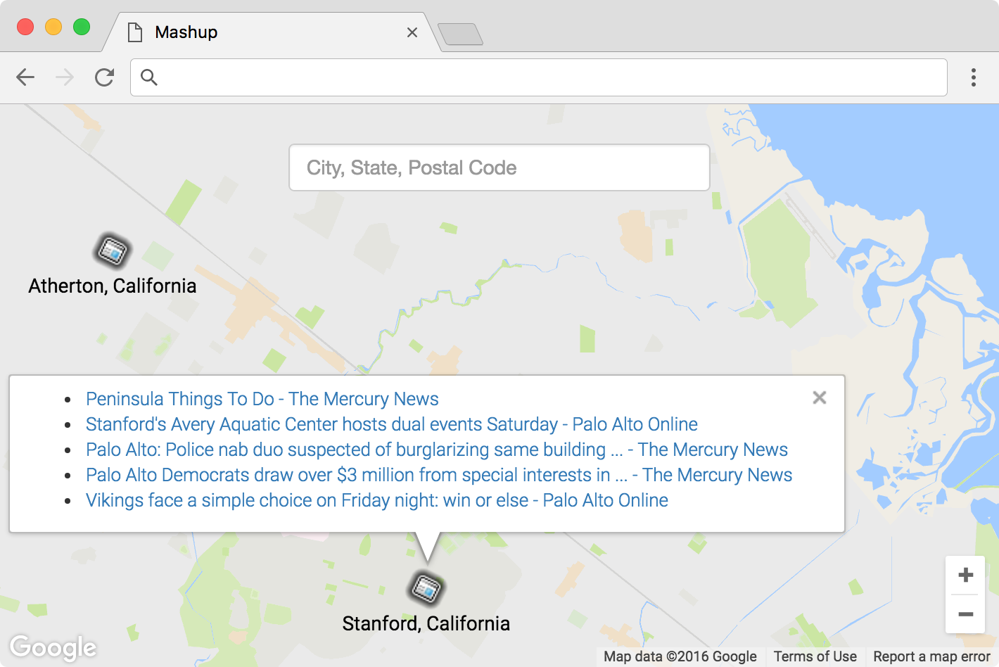

### Mashup

This is an app built for CS50's Problem Set 8, which is a website that lets users search for articles atop a map. The website presents the news from Google News on a Google Map. In addition, you can search the location of interest in the search bar, which supports an anticipation function.

.
